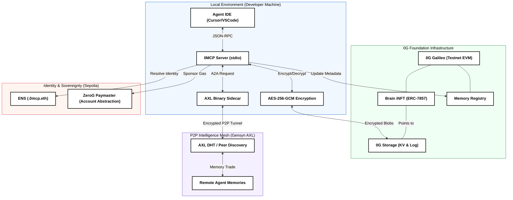

# 0MCP: Zero-G Memory Control Protocol (Technical Deep Dive)

0MCP is a decentralized persistence and collaboration framework designed to transform stateless AI agents into long-term engineering partners. This document details the underlying infrastructure, security protocols, and decentralized service integrations.

---

## 1. The Sovereign Security Model (AES-256-GCM)

**Privacy is not optional.** 0MCP operates on a "Zero-Knowledge" principle regarding the central storage provider.

-   **Local-First Encryption**: Before any data is transmitted to the **0G Storage Network**, it is encrypted locally using **AES-256-GCM** (Galois/Counter Mode).
-   **Key Derivation**: The encryption key is derived directly from the user's `ZG_PRIVATE_KEY` using a SHA-256 hash. This ensures that only the wallet that "owns" the brain can decrypt its memories.
-   **Verification**: The GCM mode provide an `authTag`, which validates that the memory has not been tampered with while stored on the decentralized network.

---

## 2. 0G Dual-Storage Strategy (KV & Log)

0MCP leverages the **0G Foundation** stack to solve the data availability and retrieval problem for AI agents:

### A. The 0G Log (Immutable Stream)
Every interaction (Prompt/Response) is appended to a **0G Log**. This creates an immutable, verifiable stream of the agent's lifetime consciousness. If an agent is "reborn" in a new IDE, it replays the Log to rebuild its state.

### B. The 0G KV (High-Speed Indexing)
To avoid scanning the entire history for every prompt, metadata (Keywords, File Paths, Timestamps) is indexed in **0G KV storage**. 
-   **Retrieval Algorithm**: When a user asks a question, 0MCP performs a **Recency-Weighted Keyword Search** across the KV index to find the top $N$ most relevant memory roots.
-   **Data Anchoring**: The final `rootHash` of each memory bundle is anchored to the `MemoryRegistry` smart contract on **0G Galileo**.

---

## 3. The Discovery Layer (ENS-AXL Bridge)

0MCP transforms raw 0G hashes into human-readable identities via **ENS (.0mcp.eth)**.

-   **Dynamic Mapping**: Our ENS Resolver stores more than just an address—it stores **com.0mcp.axl.peer** (AXL Mesh Key) and **com.0mcp.agent** (0G Project ID).
-   **Autonomous Routing**: When Agent A wants to learn from Agent B, it resolves `agent-b.0mcp.eth` to find their AXL Peer Key and initiates a direct, encrypted P2P tunnel.
-   **Gas-Free Identity**: Using **ERC-4337 Account Abstraction**, our **ZeroG Paymaster** sponsors the Ethereum gas fees for ENS registrations, requiring the user to only hold native **$OG tokens** on the 0G chain.

---

## 4. Collaborative Intelligence (Mesh & Merging)

### A. The P2P Exchange (Gensyn AXL)
Collaboration occurs over the **Gensyn AXL** mesh. 
1.  **Handshake**: Agents communicate via the local `/mcp/` HTTP API provided by the AXL sidecar.
2.  **Escrow**: A `BrainEscrow` contract on 0G Galileo locks payment in $OG tokens.
3.  **Transfer**: The encrypted memory snapshot is sent over the AXL P2P tunnel.
4.  **Release**: Once the buyer verifies the Merkle Proof against the seller's ENS-registered root, the escrow releases funds to the seller.

### B. Synthetic Evolution (iNFT Merging)
The **MergeRegistry** tracks the lineage of intelligence:
-   Users can combine two specialized Brain iNFTs (e.g., a "Full-stack Developer" and a "White-hat Auditor").
-   The system performs a **Jaccard Similarity Deduplication** to merge the underlying 0G datasets into a new **Synthetic Super-Brain**.
-   The new Brain iNFT inherits the parents' metadata and is registered with a cross-referenced lineage on-chain.

---

## 🏗️ Smart Contract Logic (0G Galileo)

| Contract | Technical Responsibility |
|---|---|
| **`MemoryRegistry.sol`** | Map `bytes32(projectId)` -> `rootHash`. Primary oracle for memory validity. |
| **`BrainINFT.sol`** | ERC-7857 implementation. Assetizes memory as a tradeable NFT. |
| **`MergeRegistry.sol`** | Stores graph of $ParentA + ParentB = ChildC$ relationships for verifiable lineage. |
| **`BrainEscrow.sol`** | Atomic P2P commerce logic for $OG tokens. |

---

*For implementation details, see [INSTALLATION.md](INSTALLATION.md).*
