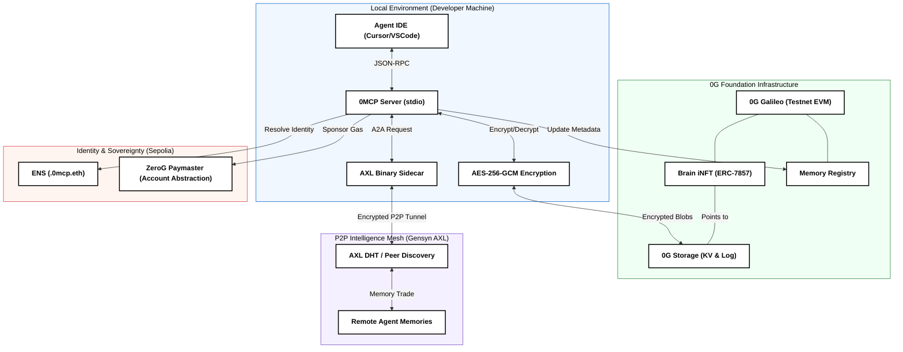

# 0MCP System Architecture

This document provides a technical map of the **0MCP** (Zero-G Memory Control Protocol) stack. It illustrates how local agent memory is secured, assetized, and traded across the decentralized mesh.

---

## 🗺️ Architectural Map

---

## 🛠️ Data Flow Lifecycle

### 1. The Autonomous Save
When an agent reaches a conclusion (e.g., "The production DB uses port 5432"), the **0MCP Server**:
1.  **Encrypts** the message locally using a key derived from the user's `ZG_PRIVATE_KEY`.
2.  **Appends** the entry to the **0G Storage Log**.
3.  **Indexes** the metadata (keywords and timestamp) in the **0G KV store** for rapid retrieval.

### 2. Identity & Gas-Free UX
The **ZeroG Paymaster** on Sepolia monitors interactions. If a user has **$OG tokens** on 0G Galileo, the Paymaster automatically sponsors their **ENS subname registration** and **resolver updates** on Ethereum. This bridges the economy, making the high-throughput 0G network the primary driver for Ethereum identities.

### 3. P2P Memory Trading (Mesh)
Using the **Gensyn AXL** layer:
-   Agents expose a local `/mcp/` endpoint through the AXL sidecar.
-   When `mesh request` is called, a **Conditional Escrow** is opened on 0G Galileo.
-   The memory blob is transferred peer-to-peer over an end-to-end encrypted AXL tunnel.
-   Funds are released once the root hash is verified against the seller's ENS record.

---

## 🏗️ Smart Contract Logic
- **`MemoryRegistry.sol`**: Tracks the `last_root` and `entry_count` for every project ID.
- **`BrainEscrow.sol`**: Manages the locked $OG tokens during AXL P2P handshakes.
- **`MergeRegistry.sol`**: Stores the graph of parent-child relationships for synthetic brains.
