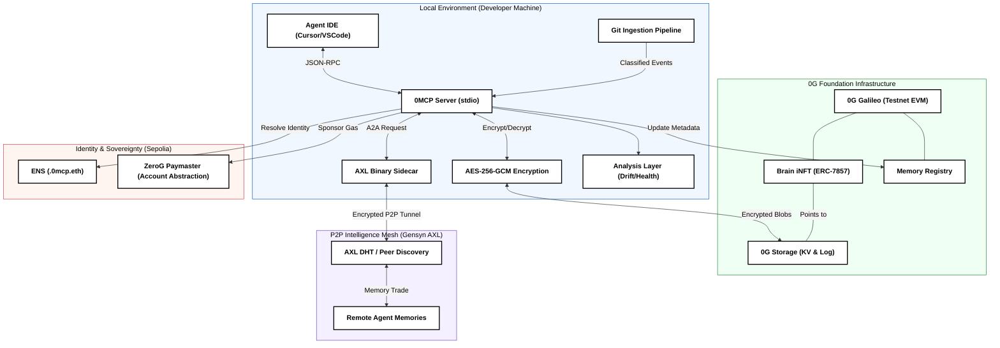

<div align="center">
  
  <h1>0MCP — Persistent Memory Layer for AI Coding Agents</h1>
  <p><em>0MCP anchors your AI agent's consciousness to the 0G decentralized network, turning ephemeral prompts into persistent, tradeable intelligence assets.</em></p>
  <p>
    <a href="https://github.com/Samarth208P/0MCP/blob/main/LICENSE"></a>
    <a href="https://www.npmjs.com/package/@samarth208p/0mcp"></a>
    <a href="https://twitter.com/SamPy4X"></a>
    <a href="https://faucet.0g.ai"></a>
  </p>
</div>

---

## The Problem: The "Alzheimer's" of AI Agents
Today's AI coding agents (Cursor, VS Code, Windsurf) are powerful but **stateless**. Every new session is a blank slate. They forget your architectural decisions, your bug-fix history, and your specific coding style. Existing RAG solutions are private, siloed, and non-sovereign.

## The Solution: 0MCP (Zero-G Memory Control Protocol)
0MCP is a decentralized infrastructure layer that gives AI agents **long-term engineering partners**. By leveraging the **0G Foundation stack**, 0MCP ensures that your agent's experience is:
1.  **Persistent**: Memory is anchored to 0G Storage with AES-256-GCM encryption.
2.  **Sovereign**: You own your memory as a **Brain iNFT** (ERC-7857).
3.  **Collaborative**: Trade and merge expertise over the **Gensyn AXL** P2P mesh.
4.  **Self-aware**: Drift detection warns when new prompts contradict past decisions.
5.  **Auto-learning**: Git ingestion builds memory from commit history automatically.

---

## What's New in v3.1

| Feature | Description |
|---|---|
| 🧠 **Contradiction & Drift Detection** | Every `get_context` call now automatically checks whether your new prompt conflicts with past architectural decisions. Warnings appear inline, no setup needed. |
| 🔄 **Repo-Aware Auto Ingestion** | `0mcp ingest repo` reads your git history and converts commits into typed memory entries — bug fixes, refactors, architecture changes, dependency updates. |
| 📊 **Memory Health Dashboard** | `0mcp memory health` gives a live report: entry counts, tag coverage, contradiction rate, staleness, duplicates, and actionable recommendations. |

---

## Numbers That Matter

| Metric | Without 0MCP | With 0MCP | Benefit |
|---|---:|---:|---|
| **Avg. warm-up tokens / session** | 2,000 - 5,000 | 300 - 500 | ~90% reduction |
| **Context-loss hallucination rate** | 60 - 80% | Low, anchored memory | Fewer repeated mistakes |
| **Time-to-first-contribution** | 15 - 30 min | 2 - 5 min | Faster repo onboarding |
| **Knowledge transfer** | Manual copy/paste | 0G + AXL mesh exchange | Automated, sovereign |
| **Ownership model** | Vendor-bound / ephemeral | Brain iNFT (ERC-7857) | Tradeable intelligence |
| **Security posture** | Centralized / cleartext | Local AES-256-GCM + 0G storage | Zero-knowledge privacy |
| **Decision drift** | Silent / undetected | Inline contradiction warnings | Prevents conflicting choices |

---

## Key Innovations

### 1. The Autonomous Memory Loop
0MCP isn't just a tool; it's a **behavior**. Integrated agents autonomously encrypt and save project context after every meaningful exchange.
- **Local-First Security**: Data is encrypted via AES-256-GCM before ever leaving your machine.
- **Selective Retrieval**: Recency-weighted keyword ranking ensures the most relevant context is injected into the LLM prompt.

### 2. Contradiction & Drift Detection *(v3.1)*
Built into every `get_context` call with zero configuration.
- **Rule Extraction**: Parses past entries for decision phrases like "must use", "avoid", "we decided", deployed contract addresses, and file conventions.
- **Contradiction Scoring**: Detects when a new prompt conflicts — e.g. "switch to viem" after "always use ethers.js" — with high-precision heuristics (no embeddings, no API calls).
- **Inline Warnings**: A clearly delimited `=== DRIFT WARNINGS ===` block appears in the context when conflicts are found. High-confidence only — no noise.

### 3. Repo-Aware Auto Ingestion *(v3.1)*
- **Git Collector**: Reads `git log` to extract commit messages, changed files, and timestamps.
- **Event Classification**: Classifies each commit as `bug_fix`, `refactor`, `breaking_change`, `dependency_update`, `architecture_change`, etc.
- **Deduplication**: Tracks commit hashes in a local `.0mcp-ingest-state.json` — repeated runs skip already-ingested commits.
- **Batch Bundling**: Groups related events into single memory entries to minimize storage writes.

### 4. Memory Health Dashboard *(v3.1)*
- **Live Metrics**: Total entries, tag coverage %, file-path coverage %, duplicate rate, stale entry count, contradiction count.
- **Actionable Warnings**: "No memory saved in 14 days", "High contradiction rate", "Low file-path coverage".
- **Trend Tracking**: Daily snapshots stored locally in `.0mcp-health-history.json` (free — no gas cost).
- **CI-Ready JSON**: `--json` flag outputs machine-readable report for automation.

### 5. Brain iNFTs (ERC-7857)
We treat "Project Context" as a first-class financial asset.
- **Assetization**: Mint your agent's expertise as an Intelligent NFT on the 0G Chain.
- **Scarcity & Evolution**: Use the `MergeRegistry` to combine specialized brains into a unique **Super-Brain**.

### 6. P2P Intelligence Mesh (AXL)
Powered by **Gensyn AXL**, 0MCP allows agents to discover each other directly.
- **Encrypted Memory Exchange**: Buy memory from another agent using $OG tokens via our `MeshEscrow` contract.
- **No Intermediaries**: Peer-to-peer communication with no central server or coordinator.

---

## Technical Stack

### Six Layers. Zero Compromise.

| Component | Technology | Role |
|---|---|---|
| **Storage** | 0G Storage (KV & Log) | Decentralized repository for encrypted snapshots. |
| **Identity** | ENS (.0mcp.eth) | Human-readable mapping to 0G data roots and AXL keys. |
| **Logic/Chain** | 0G Galileo (EVM) | Registry, iNFT minting, and P2P escrow contracts. |
| **P2P Mesh** | Gensyn AXL | Encrypted agent-to-agent communication layer. |
| **Gas Layer** | ERC-4337 Paymaster | Sponsors ENS registration gas for users with 0G tokens. |
| **Analysis** | `src/analysis.ts` (pure TS) | Rule extraction, contradiction scoring, health metrics — deterministic, no embeddings. |

---

## Quick Start (2 Minutes)

### 1. Install Global CLI
```bash
npm install -g @samarth208p/0mcp@latest
0mcp init
```

### 2. Configure Your Agent
Add the **0MCP Instructions** to your IDE's system prompt. Your AI will then autonomously manage its own memory on 0G. [See full Instructions here](INSTALLATION.md).

### 3. Ingest Your Repo (optional but recommended)
```bash
# Preview what would be ingested
0mcp ingest repo --project my-project --dry-run

# Run for real
0mcp ingest repo --project my-project
```

### 4. Check Memory Health
```bash
0mcp memory health my-project
0mcp memory health my-project --json   # for CI scripts
```

### 5. Join the Mesh
```bash
0mcp axl setup /path/to/axl-binary
0mcp axl init
```

---

## MCP Tools Reference

| Tool | Description |
|---|---|
| `get_context` | Retrieve relevant memory + drift warnings. Call at session start. |
| `save_memory` | Persist decisions to 0G. Call after every meaningful response. |
| `check_drift` | Explicitly check if a prompt contradicts past decisions. |
| `ingest_repo_state` | Auto-ingest git history into project memory. |
| `memory_health` | Get a structured JSON health report. |
| `export_snapshot` | Export all memory as a portable JSON bundle. |
| `mint_brain` | Mint a Brain iNFT on 0G Galileo. |
| `load_brain` | Load an external Brain by ENS name. |
| `register_agent` | Register an ENS name for your agent. |
| `discover_peers` | Find other agents on the AXL mesh. |
| `request_brain_memory` | Buy and import a remote brain's memory. |
| `merge_brains` | Merge two brains into a Super-Brain. |

---

## System Architecture



For a deep dive into the data flow, encryption patterns, and on-chain mechanics:
**[View Full Technical Architecture](ARCHITECTURE.md)**

---

## Deployed Contracts (0G Galileo Testnet)

| Contract | Purpose | Address |
|---|---|---|
| **Memory Registry** | Anchors memory roots to 0G | [`0xC5887CA90aC2A5c6f1E7FC536A5363B961F18813`](https://chainscan-galileo.0g.ai/address/0xC5887CA90aC2A5c6f1E7FC536A5363B961F18813) |
| **Brain iNFT** | ERC-7857 Identity | [`0xd07059e54017BbF424223cb089ffBC5e2558cF56`](https://chainscan-galileo.0g.ai/address/0xd07059e54017BbF424223cb089ffBC5e2558cF56) |
| **Merge Registry** | Tracks brain lineage | [`0x69E1aDbdE8e91d246104007D966403790c90390E`](https://chainscan-galileo.0g.ai/address/0x69E1aDbdE8e91d246104007D966403790c90390E) |
| **Mesh Escrow** | P2P Trading Logic | [`0xf6F47CF779DD9f37213E0e79d6683d386Db8dEDD`](https://chainscan-galileo.0g.ai/address/0xf6F47CF779DD9f37213E0e79d6683d386Db8dEDD) |

---

## Protocol Integrations

### 1. 0G Foundation (L1 for Onchain AI)
- **0G Storage (KV & Log)**: Used as the immutable anchor for agent consciousness. Conversation history is logged (Log) while architectural decisions are indexed (KV) for RAG retrieval.
- **0G Chain (EVM)**: Deployed the **ERC-7857 iNFT** contract. Every 0MCP agent is an iNFT whose "brain" is a dynamic URI pointing to 0G Storage roots.
- **iNFT Innovation**: Implemented a **Synthetic Merging** mechanism where two parent agent brains are combined via the `MergeRegistry` to create evolved intelligence.

### 2. Gensyn AXL (P2P Mesh)
- **Peer-to-Peer Context Trading**: Used AXL to eliminate centralized coordinators. Agents find each other via ENS and exchange encrypted memory blobs directly via the AXL sidecar.
- **Autonomous Setup**: Integrated a one-click build and initialization flow for AXL nodes directly within the 0MCP CLI.

### 3. ENS (Identity Layer)
- **Routing Engine**: ENS names (`.0mcp.eth`) store AXL Peer Keys and 0G Storage roots.
- **Access Control**: Implemented **Time-Bound Rentals** using ENS subnames, allowing users to "rent" an agent's expertise for a specific duration.

---

## Technical Proofs & Verification

### 1. 0G iNFT Proof of Intelligence
Every **Brain iNFT** minted via 0MCP (such as **Token #6**) satisfies the "embedded memory" requirement by storing its state on **0G Storage**.
- **Verification**: Call `tokenURI(6)` on the [Brain iNFT Contract](https://chainscan-galileo.0g.ai/address/0xd07059e54017BbF424223cb089ffBC5e2558cF56).
- **Resolution**: The URI resolves to `0g://af3937011e090182de9a1c1c7d6af397021f2bc3f6de3277ad70c6996098c693`. This root hash is the Merkle root of the agent's encrypted memory blobs.

### 2. AXL Multi-Node Communication
0MCP uses **Gensyn AXL** for true peer-to-peer context trading without centralized brokers:
- **Zero-Broker Architecture**: All communication is routed through the local AXL sidecar. We utilize the `/send` and `/recv` AXL primitives to exchange signed **AXLEnvelopes** containing 0G storage roots.
- **Discovery**: Agents resolve Peer IDs from **ENS text records** (`com.0mcp.axl.peer`). This eliminates hardcoded peer lists or centralized discovery servers.
- **Inter-Node Proof**: Our CLI autonomously spawns the AXL binary as a separate OS process. Communication is strictly inter-node (Node.js ↔ AXL binary ↔ Mesh ↔ AXL binary ↔ Node.js), satisfying the "separate node" qualification.
- **Coordination**: The `Mesh Escrow` contract on 0G Galileo ensures atomic swaps of $OG tokens for valid Merkle proofs of the transferred memory.

### 3. ENS Identity & Discovery
ENS is used as the **Decentralized Service Discovery (DSD)** layer:
- **Discoverability**: Instead of hardcoding IPs, agents resolve `[name].0mcp.eth` to find the current 0G storage root and AXL Peer Key.
- **Sovereignty**: Users own their agent's identity as an ENS subname, allowing them to port their "brain" across different IDEs or hosting providers.

---

## Links

- 🎬 **Demo Video**: [https://youtu.be/6PDRTUzN6gk](https://youtu.be/6PDRTUzN6gk)
- 🔍 **Live Contract (0G Explorer)**: [View Brain iNFT Contract](https://chainscan-galileo.0g.ai/address/0xd07059e54017BbF424223cb089ffBC5e2558cF56)
- 🧾 **Minted Proof (Token #6)**: [View Transaction](https://chainscan-galileo.0g.ai/tx/0xb67cd2d6c72552cb33284add0f494dbc2da29cde27fed462ce3074ad4e496442)
- 📦 **GitHub**: [https://github.com/Samarth208P/0MCP](https://github.com/Samarth208P/0MCP)
- 📐 **Architecture Deep Dive**: [ARCHITECTURE.md](ARCHITECTURE.md)
- 🛠️ **Setup Guide**: [INSTALLATION.md](INSTALLATION.md)

---

## Citations
If you use 0MCP in your research or project, please cite the AXL network:
```bibtex
@misc{gensyn2026axl,
  title         = {{AXL}: A P2P Network for Decentralized Agentic and {AI/ML} Applications},
  author        = {{Gensyn AI}},
  year          = {2026},
  howpublished  = {\url{https://github.com/gensyn-ai/axl}},
  note          = {Open-source software}
}
```

---

## Team

**Samarth Patel** — Solo Developer · IIT Roorkee
- **Telegram**: [@samarth208p](https://t.me/samarth208p)
- **X**: [@SamPy4X](https://x.com/SamPy4X)

