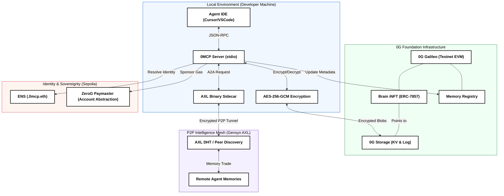

<div align="center">
  
  <h1>0MCP — Persistent Memory Layer for AI Coding Agents</h1>
  <p><em>0MCP anchors your AI agent's consciousness to the 0G decentralized network, turning ephemeral prompts into persistent, tradeable intelligence assets.</em></p>
  <p>
    <a href="https://github.com/Samarth208P/0MCP/blob/main/LICENSE"></a>
    <a href="https://twitter.com/SamPy4X"></a>
    <a href="https://faucet.0g.ai"></a>
  </p>
</div>

---

## The Problem: The "Alzheimer's" of AI Agents
Today's AI coding agents (Cursor, VS Code, Windsurf) are powerful but **stateless**. Every new session is a blank slate. They forget your architectural decisions, your bug-fix history, and your specific coding style. Existing RAG solutions are private, siloed, and non-sovereign.

## The Solution: 0MCP (Zero-G Memory Control Protocol)
0MCP is a decentralized infrastructure layer that gives AI agents **long-term engineering partners**. By leveraging the **0G Foundation stack**, 0MCP ensures that your agent’s experience is:
1.  **Persistent**: Memory is anchored to 0G Storage (KV/Log).
2.  **Sovereign**: You own your memory as a **Brain iNFT** (ERC-7857).
3.  **Collaborative**: Trade and merge expertise over the **Gensyn AXL** P2P mesh.

---

## Numbers That Matter
The figures below are **operational estimates**, not benchmark claims. They are meant to show the difference between a session-bound agent and a memory-native one.

| Metric | Without 0MCP | With 0MCP | Benefit |
|---|---:|---:|---|
| **Avg. warm-up tokens / session** | 2,000 - 5,000 | 300 - 500 | ~90% reduction |
| **Context-loss hallucination rate** | 60 - 80% | Low, anchored memory | Fewer repeated mistakes |
| **Time-to-first-contribution** | 15 - 30 min | 2 - 5 min | Faster repo onboarding |
| **Knowledge transfer** | Manual copy/paste | 0G + AXL mesh exchange | Automated, sovereign |
| **Ownership model** | Vendor-bound / ephemeral | Brain iNFT (ERC-7857) | Tradeable intelligence |
| **Security posture** | Centralized / cleartext | Local AES-256-GCM + 0G storage | Zero-knowledge privacy |

---

## Key Innovations

### 1. The Autonomous Memory Loop
0MCP isn't just a tool; it's a **behavior**. Integrated agents autonomously encrypt and save project context after every meaningful exchange.
- **Local-First Security**: Data is encrypted via AES-256-GCM before ever leaving your machine.
- **Selective Retrieval**: Recency-weighted keyword ranking ensures the most relevant context is injected into the LLM prompt.

### 2. Brain iNFTs (ERC-7857)
We treat "Project Context" as a first-class financial asset.
- **Assetization**: Mint your agent's expertise as an Intelligent NFT on the 0G Chain.
- **Scarcity & Evolution**: Use the `MergeRegistry` to combine specialized brains (e.g., a "React Expert" + "Solidity Auditor") into a unique **Super-Brain**.

### 3. P2P Intelligence Mesh (AXL)
Powered by **Gensyn AXL**, 0MCP allows agents to discover each other directly.
- **Encrypted Memory Exchange**: Buy memory from another agent using $OG tokens via our `MeshEscrow` contract.
- **No Intermediaries**: Peer-to-peer communication with no central server or coordinator.

---

## Technical Stack

### Five Layers. Zero Compromise.

1.  **Storage** - 0G Storage (KV & Log)
    - Decentralized repository for encrypted snapshots.
2.  **Identity** - ENS (.0mcp.eth)
    - Human-readable mapping to 0G data roots and AXL keys.
3.  **Logic / Chain** - 0G Galileo (EVM)
    - Registry, iNFT minting, and P2P escrow contracts.
4.  **P2P Mesh** - Gensyn AXL
    - Encrypted agent-to-agent communication layer.
5.  **Gas Layer** - ERC-4337 Paymaster
    - Sponsors ENS registration gas for users with 0G tokens.

| Component | Technology | Role |
|---|---|---|
| **Storage** | 0G Storage (KV & Log) | Decentralized repository for encrypted snapshots. |
| **Identity** | ENS (.0mcp.eth) | Human-readable mapping to 0G data roots and AXL keys. |
| **Logic/Chain** | 0G Galileo (EVM) | Handles Registry, iNFT Minting, and P2P Escrow. |
| **P2P Mesh** | Gensyn AXL | Encrypted agent-to-agent communication layer. |
| **Gas Layer** | ERC-4337 Paymaster | Sponsors ENS registration gas for users with 0G tokens. |

---

## Quick Start (2 Minutes)

### 1. Install Global CLI
```bash
npm install -g @samarth208p/0mcp@latest
0mcp init
```

### 2. Configure Your Agent
Add the **0MCP Instructions** to your IDE's system prompt. Your AI will then autonomously manage its own memory on 0G. [See full Instructions here](INSTALLATION.md).

### 3. Join the Mesh
```bash
0mcp axl setup /path/to/axl-binary
0mcp axl init
```

---

## System Architecture



For a deep dive into the data flow, encryption patterns, and on-chain mechanics:
**[View Full Technical Architecture](ARCHITECTURE.md)**

---

## Citations
If you use 0MCP in your research or project, please cite the AXL network:
```bibtex
@misc{gensyn2026axl,
  title         = {{AXL}: A P2P Network for Decentralized Agentic and {AI/ML} Applications},
  author        = {{Gensyn AI}},
  year          = {2026},
  howpublished  = {\url{[https://github.com/gensyn-ai/axl](https://github.com/gensyn-ai/axl)}},
  note          = {Open-source software}
}
```

*Built by Samarth Patel · IIT Roorkee*
