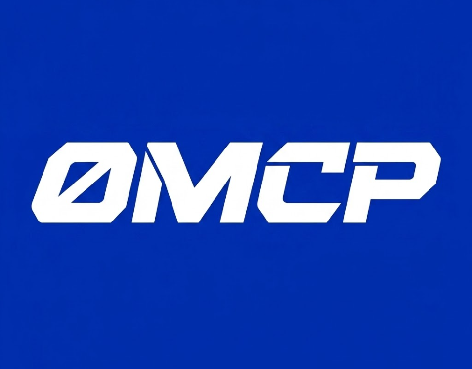

<div align="center">
  
  <h1>0MCP — Persistent Memory Layer for AI Coding Agents</h1>
  <p><em>An MCP server giving your AI agent secure, persistent memory on 0G — turning expertise into a tradeable asset, discoverable via ENS.</em></p>
  <p><strong>ETHGlobal Open Agents 2026</strong> · Solo Project · Samarth Patel, IIT Roorkee</p>
</div>

---

## ⚡ Quick Start (Setup in 2 Minutes)

```bash
# 1. Install & Build
git clone https://github.com/Samarth208P/0MCP.git
cd 0MCP
npm install && npm run build

# 2. Run Setup Wizard (Generates keypairs & scaffold .env)
npm run setup

# 3. Verify & Demo
npm run cli -- demo
```

**Connect your IDE:** Add 0MCP to Cursor, Windsurf, or VS Code MCP settings:
- **Command:** `node <absolute-path-to-0MCP>/build/src/index.js`
- **Transport:** `stdio`

---

## 🚀 Key Features

0MCP transforms your AI from a stateless chatbot into a compounding engineering partner. Every prompt is silently enriched with encrypted project history.

* **🧠 Persistent Context (0G Storage):** No more "Goldfish memory." Your agent remembers past architectural decisions and bug fixes. Memory is stored reliably on 0G's decentralized data availability layer.
* **🔐 AES-256-GCM Encryption:** Absolute privacy. All context payloads are encrypted locally using AES-GCM derived from your private key before being sent to 0G. Only you can decrypt your agent's memory.
* **🧩 IDE Native (MCP):** Zero changes to your workflow. Works out-of-the-box with Cursor, VS Code, and Windsurf via the Model Context Protocol.
* **💎 Brain iNFTs (ERC-7857):** Accumulate your agent's context over a project and mint it as an intelligent NFT. Share, rent, or sell your agent's domain expertise to others.
* **🌐 ENS Identity Layer:** Brains aren't just hashes; they are discoverable via ENS (e.g., `solidity-auditor.0mcp.eth`). Rental access is granted seamlessly via ENS subnames (`renter.solidity-auditor.0mcp.eth`).
* **🛡️ KeeperHub Protected Execution:** When your agent needs to execute an on-chain transaction, 0MCP routes it safely through KeeperHub's MCP proxy, guaranteeing MEV-protection and dynamic gas execution.
* **🦄 Uniswap V4 Payments:** Want to rent a Brain priced in WETH, but only have USDC? The agent automatically constructs a Uniswap V4 auto-swap and routes it through KeeperHub. Pay in any token.

---

## 🏗️ Architecture Stack

| Layer | Technology |
|---|---|
| **Protocol** | Model Context Protocol (MCP) JSON-RPC |
| **Storage & Compute** | 0G Storage Turbo + 0G Storage Indexer |
| **Assetization** | Brain iNFT (ERC-7857) on 0G Chain |
| **Identity & Access** | ENS Text Records & Subname Issuance |
| **On-Chain Execution** | KeeperHub |
| **Payment Routing** | Uniswap V4 SDK |

---

## 📖 The Core Loop

1. **Prompt:** You type a prompt in Cursor / VS Code.
2. **Retrieve:** 0MCP intercepts it, querying 0G for relevant project history.
3. **Decrypt & Inject:** Context is decrypted locally and injected into the LLM's system prompt.
4. **Respond:** Your AI model responds — now with full project memory.
5. **Encrypt & Save:** The new interaction is encrypted (AES-256-GCM) and logged immutably back to 0G.

*Built during ETHGlobal Open Agents 2026*
