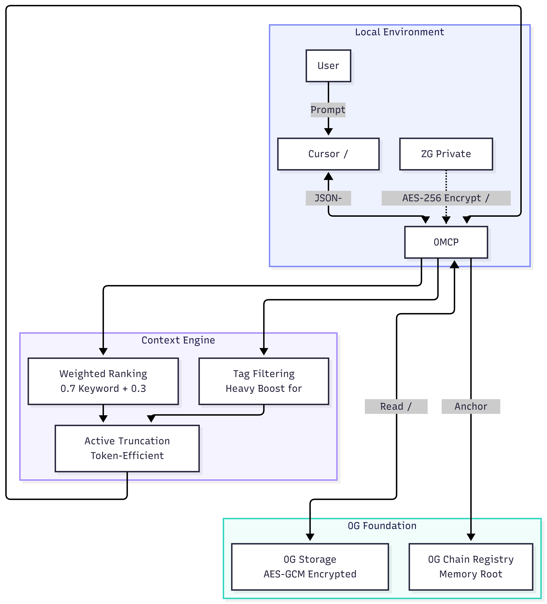
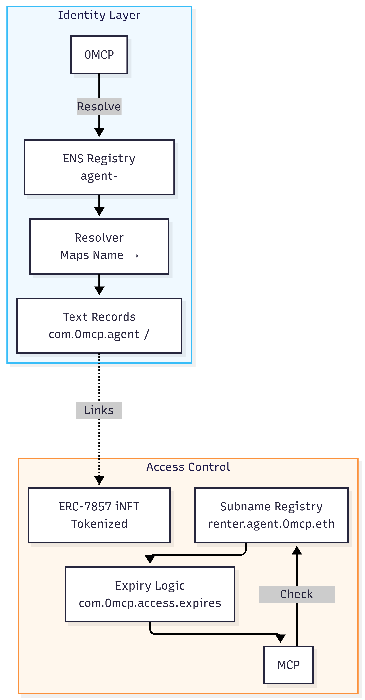
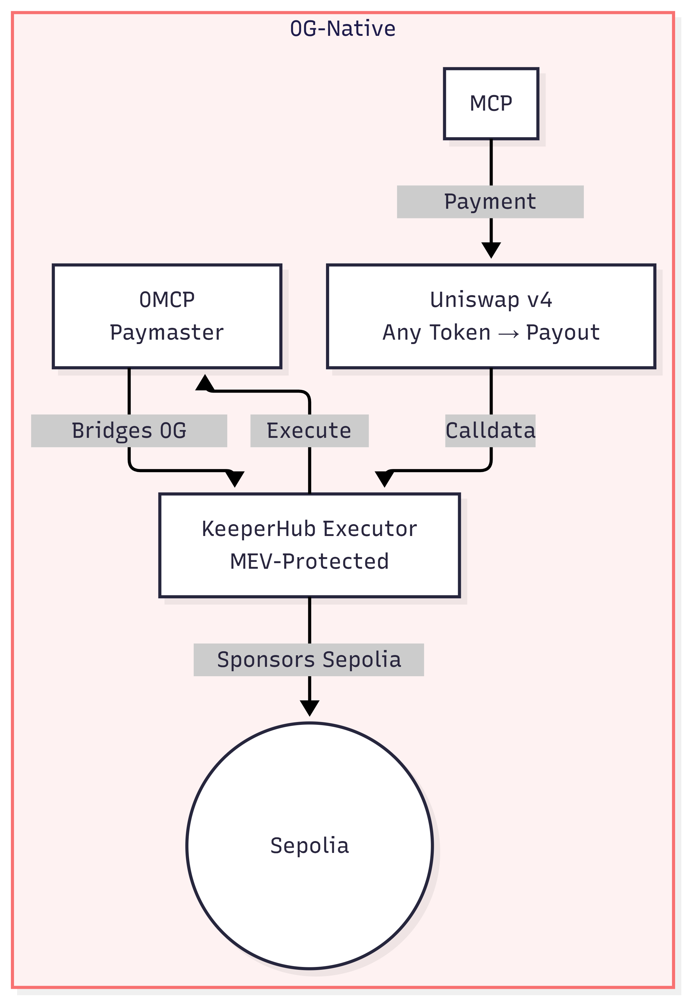

<div align="center">
  
  <h1>0MCP — Persistent Memory Layer for AI Coding Agents</h1>
  <p><em>0MCP anchors your AI agent's consciousness to the 0G decentralized network, turning ephemeral prompts into persistent, tradeable intelligence assets.</em></p>
  <p>Solo Project · Samarth Patel, IIT Roorkee</p>
</div>

---

## The 0G Advantage: Decentralized Agent Intelligence
0MCP is built primarily to leverage the **0G Foundation stack**. It transforms local AI coding agents into decentralized entities by treating the 0G Network as the permanent, secure, and verifiable repository of agent expertise.

- **0G Storage (KV/Log):** Every interaction is encrypted and logged to 0G, creating an immutable history of project decisions.
- **0G Chain (ERC-7857):** Agent expertise is assetized as "Brain iNFTs," allowing intelligence to be minted, shared, and monetized on the 0G network.
- **0G-Native Economy:** Users can operate entirely using 0G tokens, with all gas and cross-chain complexities handled by our integrated Paymaster and KeeperHub executors.

---

## Submission Details

*   **Project Name:** 0MCP
*   **Description:** A decentralized persistent memory layer for AI agents. 0MCP transforms stateless LLMs into long-term engineering partners by anchoring context to 0G Storage and identities to ENS.
*   **Demo Video:** [Link to 3-min Video] (Coming Soon)
*   **Live Demo:** [Link to Live Demo] (Coming Soon)
*   **Team:** Samarth Patel
    *   **Telegram:** [@samarth208p](https://t.me/samarth208p)
    *   **X (Twitter):** [SamPy4X](https://x.com/SamPy4X)

### Contract Deployment Addresses
| Contract | Address | Network |
|---|---|---|
| **Memory Registry** | `0xC5887CA90aC2A5c6f1E7FC536A5363B961F18813` | **0G Galileo (Testnet)** |
| **Brain iNFT (ERC-7857)** | `0xd07059e54017BbF424223cb089ffBC5e2558cF56` | **0G Galileo (Testnet)** |
| **ZeroG Paymaster** | `0xb1Ab695dbcbA334A60712234d46264A617AD6d7f` | **Sepolia (Ethereum)** |
| **Subname Registrar** | `0xA2C96740159b7a47541DEfF991aD5edfa671661d` | **Sepolia (Ethereum)** |

---

## Quick Start (Setup in 2 Minutes)

### 1. Install and Initialise
```bash
npm install -g @samarth208p/0mcp@latest
0mcp init
```
The wizard generates your keypair, scaffolds .env, and reserves your 0G Brain identity.

### 2. Get Testnet Tokens
- **0G tokens** -> https://faucet.0g.ai (The primary currency for memory storage)
- **Sepolia ETH** -> https://sepoliafaucet.com (Optional; the built-in 0G paymaster covers this)

---

## System Architecture: Powered by 0G

### 1. The Intelligence Vault (Context and Storage)
Memory is encrypted locally via AES-256-GCM and anchored to **0G Storage**. Retrieval uses a deterministic Keyword-Recency ranking to maximize relevance while minimizing token usage.

<div align="center">
  
</div>

### 2. The Discovery Layer (ENS and Access)
ENS names (.0mcp.eth) act as the human-readable map to decentralized 0G brains. Rentals are issued as time-bound wrapped subnames.

<div align="center">
  
</div>

### 3. The Economic Engine (Payments and Gas)
A **0G-Native** economy where 0G tokens sponsor Ethereum gas via an ERC-4337 Paymaster bridge, settled through Uniswap v4 and KeeperHub.

<div align="center">
  
</div>

---

## 0G Innovation: Brain iNFTs (ERC-7857)
0MCP introduces the concept of **Intelligent NFTs** on the 0G Chain. 
- **Assetization of Expertise:** Over weeks of development, your agent builds a unique "Mental Model" of your codebase. 0MCP allows you to mint this model as a tradeable iNFT.
- **Secure Portability:** Because the metadata points directly to 0G Storage roots, your agent's brain can be loaded into any IDE, anywhere in the world, while remaining cryptographically secured.

---

## KeeperHub Innovation: The "Headless Executive" Architecture
0MCP integrates KeeperHub as the core Executive Layer to ensure that all 0G and Ethereum transactions—including brain rentals and minting—are executed with MEV protection and guaranteed delivery.

---

## KeeperHub Builder Feedback

This section provides technical feedback based on our integration of the KeeperHub MCP server and JSON-RPC execution layer.

### 1. UX and Integration Friction
*   **JSON-RPC Schema Ambiguity:** The `onchain_exec` tool schema in the MCP server does not explicitly define the units for the `slippage` parameter (e.g., basis points vs. percentage strings). This caused several `PriceLimitExceeded` reverts during initial testing.
    *   **Actionable Fix:** Update the MCP tool definition to use Zod descriptors that explicitly state: `"slippage: percentage as float (e.g. 0.5 for 0.5%)"`.
*   **Diagnostic Transparency:** When a transaction fails during the "Private RPC Routing" phase, the error returned to the MCP client is often a generic `500 Internal Server Error`.
    *   **Actionable Fix:** Provide granular error codes (e.g., `KH_001: Simulation Failed`, `KH_002: Insufficient Gas Buffer`) to allow AI agents to programmatically adjust their intent before retrying.

### 2. Documentation Gaps
*   **Uniswap v4 Hook Pathing:** The documentation for executing complex v4 swaps through KeeperHub lacks examples for pools with active hooks. We had to spend significant time calculating the `sqrtPriceLimitX96` manually to ensure compatibility with the KeeperHub executor.
    *   **Actionable Fix:** Add a "V4 Advanced" section to the docs with example calldata for hook-enabled swaps.

### 3. Feature Requests for Agentic Workflows
*   **Real-time Audit Websockets:** Currently, agents must poll the `get_tx_status` endpoint. A WebSocket stream for "Execution Events" would allow IDE-based agents (like 0MCP) to provide real-time status updates to the user (e.g., "KeeperHub is simulating your trade...") without blocking the main event loop.
*   **Contextual Metadata Tags:** Allow a `metadata` object in the execution request. If we could tag a TX with `{ "project": "0MCP", "action": "Brain-Rental" }`, it would make the KeeperHub Dashboard a powerful audit tool for multi-agent systems.
*   **Gas Price Simulation Wrapper:** A "Pre-flight" tool that estimates the total cost (including the KeeperHub premium) in both native tokens and 0G tokens. This would help 0MCP calculate accurate rental prices for users.

---

## THE CORE LOOP

1. **Prompt:** You type a prompt in your IDE.
2. **Retrieve:** 0MCP intercepts it, querying 0G for relevant project history.
3. **Decrypt and Inject:** Context is decrypted locally and injected into the LLM system prompt.
4. **Respond:** AI responds with full project memory.
5. **Encrypt and Save:** New insights are encrypted and logged back to 0G immutably.

*Built by Samarth Patel*
